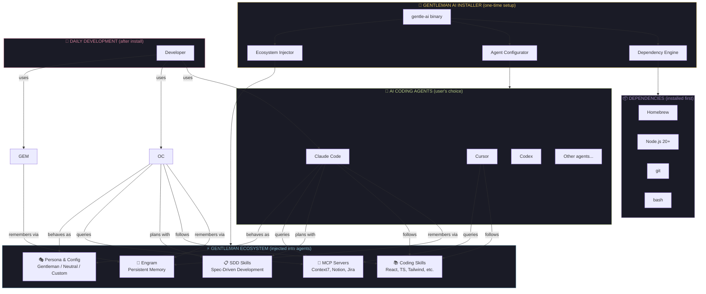
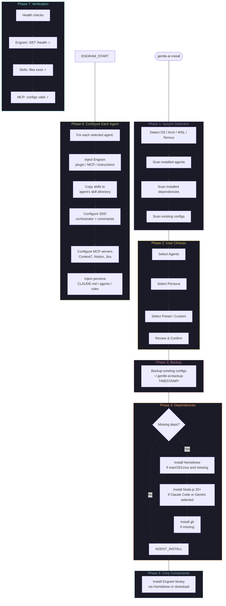
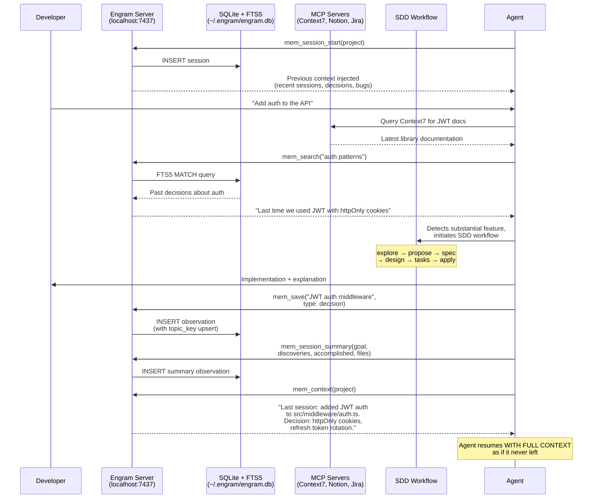

# PRD: Gentleman AI Installer

> **One command. Any agent. Any OS. The Gentleman AI ecosystem — configured and ready.**

**Version**: 0.1.0-draft
**Author**: Gentleman Programming
**Date**: 2026-02-27
**Status**: Draft

---

## 1. Problem Statement

AI-assisted development in 2026 is no longer optional — it's the standard. Every developer uses at least one AI coding agent. But here's the real problem:

**Installing an AI agent is the EASY part. Making it ACTUALLY useful is where everyone fails.**

A raw AI agent out of the box is like a sports car with no tuning — it runs, but it's nowhere near its potential. To get real value you need:

1. **Persistent memory** (Engram) — so the agent remembers decisions, bugs, and conventions across sessions
2. **MCP servers** (Context7, Notion, Jira, etc.) — so the agent can access real documentation and project management tools
3. **Coding skills** — curated best-practice patterns for React 19, Next.js 15, TypeScript, Tailwind 4, Zod 4, testing, etc.
4. **SDD workflow** (Spec-Driven Development) — so the agent plans before coding, not the other way around
5. **Proper permissions & security** — block `.env` access, require confirmation on destructive git operations
6. **A persona that teaches, not just completes** — an agent that pushes back on bad practices and explains the WHY

Most developers either:
- Use their AI agent with default config (10% of its potential)
- Spend DAYS manually configuring one agent, then can't replicate it on another machine or tool
- Never set up memory, MCP, or skills because the setup is fragmented across 5 different repos

**This installer eliminates that gap entirely.** You pick your agent(s), you pick your config level, and the entire Gentleman AI ecosystem gets injected into your tools — ready to go. From zero to championship-level AI development in minutes.

---

## 2. Vision

**The Gentleman AI ecosystem — installable by anyone, on any agent, on any OS, in one command.**

- **Engram** — persistent cross-session memory
- **SDD** — Spec-Driven Development workflow (plan before you code)
- **Skills** — curated coding patterns for modern stacks
- **MCP servers** — real documentation, Notion, Jira, and more

**After**: `curl -sL get.gentleman.ai/ai | sh` → Pick your agent(s) → Pick your config → Your agent now has memory, skills, workflow, MCP tools, and a persona that actually teaches you. Same ecosystem regardless of which tool you use.

---

## 3. Target Users

### Primary
- **Professional developers** who want to adopt AI tools seriously, not just play with them
- **Teams** that need a standardized AI development setup across members
- **Developers switching machines** who need to reproduce their AI environment quickly

### Secondary
- **Students** learning to code with AI assistance
- **DevOps/Platform engineers** automating AI tool provisioning for teams
- **Open source contributors** who want a consistent AI-assisted workflow

---

## 4. Supported Platforms

| Platform | Package Manager | Priority |
|----------|----------------|----------|
| macOS (Apple Silicon) | Homebrew | P0 |
| macOS (Intel) | Homebrew | P0 |
| Linux - Ubuntu/Debian | apt + Homebrew | P0 |
| Linux - Arch | pacman | P0 |
| Linux - Fedora/RHEL | dnf | P1 |
| WSL 2 (Windows) | apt + Homebrew | P1 |
| Windows (native) | winget / scoop / choco | P2 |
| Termux (Android) | pkg | P2 |

---

## 5. Prerequisites & Dependency Management

The installer MUST handle installing all prerequisites automatically. A user on a **clean machine** should be able to run the installer and have everything work — no manual `brew install node` beforehand.

### 5.0.1 Dependency Resolution Strategy

The installer follows a **dependency-first** approach:

1. **Detect** what's already installed and at what version
2. **Calculate** what's needed based on the user's component selections
3. **Show** the full dependency tree BEFORE installing anything
4. **Install** dependencies first, then ecosystem components
5. **Verify** each dependency after installation

```
┌──────────────────────────────────────────────────────────────────┐
│  DEPENDENCY TREE (shown to user before install)                  │
│                                                                  │
│  Base tools:                                                     │
│    ✓ git (already installed: 2.43.0)                             │
│    ✓ curl (already installed)                                    │
│    ✓ bash (already installed: 5.2)                               │
│    ◌ Homebrew (will install)                                     │
│                                                                  │
│  Runtimes (needed by selected agents):                           │
│    ✓ Go 1.25 (already installed — not needed for binary installs)│
│                                                                  │
│  AI Agents:                                                      │
│    ◌ Claude Code (via npm)                                       │
│                                                                  │
│  Ecosystem:                                                      │
│    ◌ Engram (via Homebrew — no runtime deps)                     │
│    ◌ SDD skills (file copy — no deps)                            │
│    ◌ Skills library (file copy — no deps)                        │
└──────────────────────────────────────────────────────────────────┘
```

### 5.0.2 System-Level Dependencies

These are the base tools the installer itself and the ecosystem need.

#### Always Required

| Dependency | Min Version | Why | Install Method |
|-----------|-------------|-----|----------------|

#### Conditionally Required (based on user's selections)

| Dependency | Min Version | When Needed | Install Method |
|-----------|-------------|-------------|----------------|
| **Homebrew** | Any | macOS (primary pkg manager), Linux (recommended for Engram, agents) | Official install script |
| **Go** | 1.25+ | ONLY if building Engram from source (NOT needed for binary/Homebrew install) | `brew install go` / distro package |

#### Platform-Specific Notes

| Platform | Pre-installed | Needs Installation | Special Handling |
|----------|--------------|-------------------|------------------|
| **macOS** | bash 3.2, curl, shasum, python3 | Homebrew (if not present), Node.js, git (via Xcode CLT) | `xcode-select --install` for git; `shasum` (not `sha256sum`); BSD `sed -i ''` |
| **Ubuntu/Debian** | bash, curl, git, sha256sum | Homebrew (optional), Node.js (apt version is often outdated → use NodeSource or fnm) | Node.js from apt is often v12/v16 — MUST use NodeSource repo or version manager for v20+ |
| **Arch** | bash, curl, git, python3, sha256sum | Node.js (`pacman -S nodejs npm`) | Arch packages are usually current — `pacman` versions are fine |
| **Fedora/RHEL** | bash, curl, git, sha256sum | Node.js (`dnf install nodejs`) | May need `dnf module enable nodejs:20` for correct version |
| **Termux** | bash, curl, git | Node.js (`pkg install nodejs`), python (`pkg install python`) | No sudo, no Homebrew. Commands run directly, not via `sh -c`. Go cross-compile has limitations on Android. |

### 5.0.3 Node.js Version Management

Node.js is the most critical dependency — multiple agents depend on it, and distro-packaged versions are often outdated.

**Strategy:**

| Scenario | Action |
|----------|--------|
| Node.js 20+ already installed | Use it. Do nothing. |
| Node.js installed but < 20 | Warn the user. Offer to install 20+ alongside (via fnm/nvm) or upgrade. |
| Node.js not installed at all | Install via Homebrew (`brew install node@20`) on macOS, or via fnm/NodeSource on Linux |
| `fnm` or `nvm` detected | Use the existing version manager to install/activate v20+ |

**Requirements:**
- R-DEP-01: The installer MUST detect all required dependencies and their versions BEFORE starting installation
- R-DEP-02: The installer MUST show the complete dependency tree to the user and get confirmation before installing anything
- R-DEP-03: The installer MUST install missing dependencies automatically (with user consent) using the platform's preferred package manager
- R-DEP-05: The installer MUST NOT install Go unless the user explicitly chooses to build Engram from source (pre-compiled binaries are the default)
- R-DEP-06: On Linux, the installer MUST NOT use distro-default Node.js if it's below v20 — use NodeSource, fnm, or Homebrew instead
- R-DEP-07: The installer MUST handle platform-specific differences transparently (BSD sed vs GNU sed, sha256sum vs shasum, Xcode CLT on macOS)
- R-DEP-08: The installer MUST detect existing version managers (fnm, nvm, n) and use them instead of installing Node.js system-wide
- R-DEP-09: If a dependency installation fails, the installer MUST show a clear error with manual installation instructions
- R-DEP-10: The installer MUST NOT require root/sudo for dependency installation except when absolutely necessary (e.g., `apt install`), and MUST explain why when it does
- R-DEP-11: Homebrew MUST be offered as an option on macOS, NOT forced. On Linux, the installer SHOULD prefer native package managers (pacman, dnf) where appropriate, falling back to Homebrew only when native packages are unavailable or outdated

### 5.0.4 Component → Dependency Matrix

| Component | bash | git | curl | Node.js | Homebrew | python3 | gh CLI |
|-----------|------|-----|------|---------|----------|---------|--------|
| **Engram** (binary) | — | — | ✓ (download) | — | ✓ (preferred) | — | — |
| **Claude Code** | ✓ (hooks) | ✓ | — | ✓ (20+) | ◌ | — | — |
| **Codex** | — | — | — | ✓ (18+) | — | — | — |
| **SDD Skills** | ✓ (install script) | ✓ (clone) | — | — | — | — | — |
| **Coding Skills** | — | ✓ (clone) | — | — | — | — | — |

✓ = required, ◌ = optional/conditional, — = not needed

---

## 6. Components to Install & Configure

### 6.1 AI Coding Agents

The installer supports configuring the Gentleman ecosystem into ANY AI coding agent. The user selects which ones they use (or want to use). **The primary job is CONFIGURATION, not installation** — most agents have their own install methods. The installer CAN install agents that are missing, but the core value is injecting the ecosystem.

#### Terminal-Based Agents (CLI)

| Agent | Config Location | Ecosystem Support | Priority |
|-------|-----------------|-------------------|----------|
| Codex (OpenAI) | `~/.codex/` | Partial: MCP, instructions, config.toml | P1 |
| Aider | `~/.aider/` or `.aider.conf.yml` | Partial: conventions via config, limited MCP | P2 |

#### IDE-Based Agents

| Agent | Config Location | Ecosystem Support | Priority |
|-------|-----------------|-------------------|----------|
| Cursor | `~/.cursor/` | Good: skills via .cursorrules, MCP | P1 |
| Xcode + AI extensions | Xcode config paths | Minimal: persona via project rules | P2 |
| JetBrains + AI Assistant | IDE config paths | Partial: rules, MCP via plugins | P2 |
| Antigravity | TBD (emerging agent) | TBD — implement via Agent interface when stable | P2 |
| Zed + AI | `~/.config/zed/` | Partial: assistant rules, MCP | P2 |

#### Ecosystem Support Tiers

| Tier | What Gets Configured | Agents |
|------|---------------------|--------|
| **Minimal** | Persona and coding conventions via project/workspace rules | Xcode, Antigravity, any emerging agent |

**Requirements:**
- R-AGENT-01: The installer MUST detect already-installed agents and offer configuration only (not re-install)
- R-AGENT-02: The installer MUST support configuring multiple agents in a single session
- R-AGENT-03: The installer MUST NOT require the user to provide API keys during installation (keys are configured separately by the user)
- R-AGENT-04: The installer MUST detect the user's existing agent configurations and offer to preserve, merge, or replace them
- R-AGENT-05: The installer MUST clearly show the "Ecosystem Support Tier" for each agent so users understand what they're getting
- R-AGENT-06: For agents the user doesn't have installed, the installer SHOULD offer to install them (with a clear note about what's being installed)
- R-AGENT-07: The installer architecture MUST allow adding new agents by implementing a single interface — no changes to TUI or core logic required
- R-AGENT-08: The installer MUST be forward-compatible: when new AI agents emerge, a community contributor can add support by implementing the Agent interface and submitting a PR

### 6.2 Engram (Persistent Memory System)

| Component | Method | Notes |
|-----------|--------|-------|
| Engram binary | Go install / Homebrew / direct download | Single binary, no deps |
| Engram config for Codex | Write `~/.codex/config.toml` entries | Automatic |

**Requirements:**
- R-ENGRAM-01: Engram MUST be installed as a prerequisite for any agent that supports it
- R-ENGRAM-02: The installer MUST configure Engram integration for EVERY selected agent automatically
- R-ENGRAM-03: The installer MUST verify Engram is running (health check on port 7437) after installation
- R-ENGRAM-04: The installer SHOULD configure Engram to start automatically on system boot (launchd on macOS, systemd on Linux)
- R-ENGRAM-05: If Engram is already installed, the installer MUST check the version and offer to upgrade

### 6.3 SDD (Spec-Driven Development) Skills

The full SDD Agent Team skill set (9 skills):

| Skill | Purpose |
|-------|---------|
| sdd-init | Bootstrap SDD context in a project |
| sdd-explore | Investigate ideas before committing |
| sdd-propose | Create change proposals |
| sdd-spec | Write specifications with requirements |
| sdd-design | Technical design documents |
| sdd-tasks | Break down into implementation tasks |
| sdd-apply | Implement code following specs |
| sdd-verify | Validate implementation matches specs |
| sdd-archive | Archive completed changes |

**Requirements:**
- R-SDD-04: The installer MUST pull SDD skills from the latest release of `Gentleman-Programming/sdd-agent-team`

### 6.5 MCP Servers

| MCP Server | Transport | Purpose | Priority |
|------------|-----------|---------|----------|
| Context7 | Remote HTTP | Up-to-date library documentation | P0 |
| Notion | Remote HTTP | Project management integration | P1 |
| Jira/Atlassian | Remote HTTP | Issue tracking integration | P1 |
| Custom (user-defined) | Varies | User's own MCP servers | P2 |

**Requirements:**
- R-MCP-01: The installer MUST configure selected MCP servers in each agent's MCP config
- R-MCP-02: Context7 MUST be installed by default for all agents (it requires no auth)
- R-MCP-03: For authenticated MCP servers (Notion, Jira), the installer MUST inform the user that auth tokens need to be configured separately, and provide the exact config path and documentation link
- R-MCP-04: The installer MUST NOT store or request API keys, tokens, or credentials

### 6.6 Coding Skills Library

Beyond SDD, additional coding skills that encode best practices:

| Skill Category | Skills | Priority |
|----------------|--------|----------|
| Frontend | react-19, nextjs-15, tailwind-4, zustand-5 | P1 |
| TypeScript | typescript (strict patterns) | P0 |
| Validation | zod-4 | P1 |
| AI SDK | ai-sdk-5 (Vercel AI) | P1 |
| Backend | django-drf | P2 |
| Testing | playwright, pytest, go-testing | P1 |
| API/Claude | claude-developer-platform | P0 |
| Workflow | pr-review, skill-creator, homebrew-release | P2 |

**Requirements:**
- R-SKILLS-01: The installer MUST present skills in categories and allow the user to select which categories/individual skills to install
- R-SKILLS-02: Skills MUST be installed to all selected agents simultaneously
- R-SKILLS-03: The installer MUST support a "Full Stack" preset that installs all P0 + P1 skills
- R-SKILLS-04: The installer MUST support a "Minimal" preset with only P0 skills (TypeScript + claude-developer-platform)
- R-SKILLS-05: Skills SHOULD be pulled from a central repository or registry, not embedded in the binary


#### Persona Selection — "Your own Gentleman!"

The Gentleman persona is the heart of this ecosystem, but it's **100% optional**. The user chooses their experience:

| Persona Option | Description | What it Configures |
|---------------|-------------|-------------------|
| **Neutral Mode** | Professional, helpful, no personality overlay. The agent stays with its default behavior. | Security permissions only, no persona injection |
| **Custom Persona** | Bring your own! User provides a persona description or selects from community presets. | User-provided text injected into agent instructions |

#### Other Configuration Aspects

| Config Aspect | What Gets Configured |
|---------------|---------------------|
| Permissions | Security-first defaults: deny .env, ask on destructive git ops, allow standard tools |
| Editor mode | vim / emacs / default |
| Statusline | Custom statusline with model info, git status, context usage (Claude Code) |
| Thinking verbs | Custom spinner text — Rioplatense phrases like "Tomando un Cafecito mientras Pienso" (only with Gentleman persona) |
| Keybindings | Vim-style or default |

**Requirements:**
- R-CONFIG-01: The persona selection MUST be a first-class step in the installation flow, presented clearly with personality descriptions
- R-CONFIG-02: Selecting "Gentleman Mode" MUST display the tagline "Your own Gentleman!" and a brief preview of how the agent will behave
- R-CONFIG-03: The installer MUST offer a "Custom" mode where the user can pick individual config aspects
- R-CONFIG-04: Permission defaults MUST follow the security-first model: block .env access, require confirmation for destructive git operations — REGARDLESS of persona choice (security is not optional)
- R-CONFIG-05: The installer MUST NOT overwrite existing agent configurations without explicit user consent
- R-CONFIG-06: The installer SHOULD offer to backup existing configs before making changes (same pattern as Gentleman.Dots)
- R-CONFIG-07: Thinking verbs and Rioplatense expressions MUST only be configured when Gentleman persona is selected
- R-CONFIG-08: The installer SHOULD support community-contributed personas in the future (out of scope for v1, but architecture must allow it)

---

## 7. User Experience

### 7.1 Installation Flow

```
curl -sL get.gentleman.ai/ai | sh
                  │
                  ▼
     ┌─────────────────────┐
     │   Download binary    │
     │   (detect OS/arch)   │
     └──────────┬──────────┘
                │
                ▼
     ┌─────────────────────────────────┐
     │   TUI: Welcome                   │
     │   "Gentleman AI Ecosystem"       │
     │   Supercharge your AI agents.    │
     └──────────┬──────────────────────┘
                │
                ▼
     ┌─────────────────────────────────┐
     │  System Scan                     │
     │  Detected: Claude Code ✓         │
     │            Cursor ✗              │
     │            Engram ✗              │
     │  OS: macOS (Apple Silicon)       │
     └──────────┬──────────────────────┘
                │
                ▼
     ┌─────────────────────────────────┐
     │  Select AI Agents                │  ← Shows detected (pre-checked) + available
     │  ☑ Claude Code (installed)       │
     │  ☐ Cursor                        │
     │  ...                             │
     └──────────┬──────────────────────┘
                │
                ▼
     ┌─────────────────────────────────┐
     │  Choose your Persona             │
     │                                  │
     │  ★ "Your own Gentleman!"         │  ← Senior Architect mentor, teaches,
     │     The mentor who pushes you     │     challenges, Rioplatense Spanish
     │     to understand before coding.  │
     │                                  │
     │  ○ Neutral                       │  ← No persona, default agent behavior
     │  ○ Custom                        │  ← Bring your own persona text
     └──────────┬──────────────────────┘
                │
                ▼
     ┌─────────────────────────────────┐
     │  Select Ecosystem Preset         │
     │                                  │
     │  ★ Dev Stack + Polish             │  ← Everything: Engram + SDD + Skills
     │                                  │
     │  ○ Dev Stack                     │  ← Tools without persona
     │  ○ Memory Only                   │  ← Just Engram + basics
     │  ○ Custom                        │  ← Pick each component
     └──────────┬──────────────────────┘
                │
        ┌───────┴───────┐
        │ If "Custom":  │
        │               ▼
        │  ┌──────────────────────┐
        │  │ ☑ Engram (memory)    │
        │  │ ☑ SDD (workflow)     │
        │  │ Select Skills...     │
        │  │ Select MCP servers...│
        │  └────────┬─────────────┘
        │           │
        └───────┬───┘
                │
                ▼
     ┌─────────────────────────────────┐
     │  Review & Confirm                │
     │                                  │
     │  Persona: Gentleman              │
     │  Memory: Engram ✓                │
     │  Workflow: SDD (9 skills) ✓      │
     │  Coding Skills: 15 skills ✓      │
     │  MCP: Context7, Notion ✓         │
     │                                  │
     │  [Install]  [Back]               │
     └──────────┬──────────────────────┘
                │
                ▼
     ┌─────────────────────────────────┐
     │  Configuring...                  │
     │                                  │
     │  ✓ Installing Engram             │
     │  ✓ Configuring Claude Code       │
     │    ✓ Skills (22 files)           │
     │    ✓ MCP servers                 │
     │    ✓ Engram plugin               │
     │    [████████░░] 80%              │
     └──────────┬──────────────────────┘
                │
                ▼
     ┌─────────────────────────────────┐
     │  Done! Your AI agents are ready. │
     │                                  │
     │  Next steps:                     │
     │  1. Set API keys (see below)     │
     │  2. Try: claude "hello"          │
     │                                  │
     │  For larger features, the agent  │
     │  will automatically offer SDD    │
     │  (Spec-Driven Development) to    │
     │  plan and implement step by step.│
     │                                  │
     │  Agents configured: 2            │
     │  Skills installed: 22            │
     │  Memory: Engram running ✓        │
     └─────────────────────────────────┘
```

### 7.2 Non-Interactive Mode

For CI, automation, and team provisioning:

```bash
gentle-ai install \
  --preset gentleman \
  --skills full-stack \
  --mcp context7,notion \
  --non-interactive
```

**Requirements:**
- R-UX-01: The installer MUST support both interactive TUI and non-interactive CLI modes
- R-UX-02: The TUI MUST use the Bubbletea framework with Lipgloss styling (consistent with Gentleman.Dots)
- R-UX-03: Installation progress MUST stream real-time logs to the TUI
- R-UX-04: The installer MUST show a summary of all changes before applying them
- R-UX-05: The installer MUST show clear "Next Steps" after completion (API key setup, first commands to try)
- R-UX-06: The TUI MUST support vim-style navigation (j/k, Enter, Esc)
- R-UX-07: Every step that modifies the system MUST be reversible (backup + restore)

### 7.3 Screens

| Screen | Purpose |
|--------|---------|
| Welcome | Branding, version, what this tool does |
| System Detection | Show detected OS, existing tools, existing configs, installed dependencies |
| Agent Selection | Multi-select AI agents to install/configure |
| Persona Selection | "Your own Gentleman!" / Neutral / Custom |
| Preset Selection | Dev Stack + Polish / Dev Stack / Memory Only / Custom |
| MCP Server Selection | Which MCP integrations to enable (Custom mode) |
| Skills Selection | Which coding skills to install (Custom mode) |
| Dependency Tree | Full list of what needs to be installed (deps + agents + ecosystem) with user confirmation |
| Review | Final summary of everything that will be installed/configured |
| Installing | Real-time progress: dependencies first, then agents, then ecosystem configuration |
| Complete | Success message, next steps, useful commands |
| Backup Management | List/restore/delete previous config backups |

---

## 8. Technical Architecture

### 8.0 Ecosystem Architecture — How Everything Connects

This section describes how all Gentleman ecosystem components interact with each other, both at **install time** (what the installer does) and at **runtime** (what the developer experiences daily).

#### 8.0.1 The Big Picture



#### 8.0.2 Runtime Component Interaction

This is what happens AFTER installation — the daily developer experience:

```mermaid
graph LR
    subgraph DEV_WORKFLOW["Developer Workflow"]
        direction TB
        CODE[Write Code] --> COMMIT[git commit]
        COMMIT --> PUSH[git push]
    end

        direction TB
        AGENT_CORE[Agent Core]
        AGENT_SKILLS[Loaded Skills]
        AGENT_PERSONA[Persona Rules]
        AGENT_CORE --> AGENT_SKILLS
        AGENT_CORE --> AGENT_PERSONA
    end

    subgraph MEMORY_LAYER["Engram Memory System"]
        direction TB
        MEM_SERVER[Engram Server<br/>localhost:7437]
        MEM_DB[(SQLite + FTS5<br/>~/.engram/engram.db)]
        MEM_PLUGIN --> MEM_SERVER
        MEM_SERVER --> MEM_DB
    end

    subgraph MCP_LAYER["MCP Servers"]
        C7[Context7<br/>Library Docs]
        NOTION[Notion<br/>Project Mgmt]
        JIRA[Jira<br/>Issue Tracking]
    end

    subgraph SDD_LAYER["SDD Workflow"]
        direction TB
        SDD_ORCH[Orchestrator<br/>in CLAUDE.md / agent config]
        SDD_SKILLS_2[9 Phase Skills<br/>explore → propose →<br/>spec → design → tasks →<br/>apply → verify → archive]
        SDD_ORCH --> SDD_SKILLS_2
    end

        direction TB
    end

    CODE -->|"ask AI for help"| AGENT_CORE
    AGENT_CORE -->|"search docs"| C7
    AGENT_CORE -->|"check tasks"| JIRA
    AGENT_CORE -->|"check notes"| NOTION
    AGENT_CORE -->|"save/recall memories"| MEM_PLUGIN
    AGENT_CORE -->|"plan feature"| SDD_ORCH

    style DEV_WORKFLOW fill:#1a1b26,stroke:#E0C15A,color:#E0C15A
    style AGENT_LAYER fill:#1a1b26,stroke:#7FB4CA,color:#7FB4CA
    style MEMORY_LAYER fill:#1a1b26,stroke:#B7CC85,color:#B7CC85
    style MCP_LAYER fill:#1a1b26,stroke:#957FB8,color:#957FB8
    style SDD_LAYER fill:#1a1b26,stroke:#CB7C94,color:#CB7C94
```

#### 8.0.3 Installation Pipeline — Dependency Resolution Order



#### 8.0.4 Agent Configuration Matrix — What Gets Injected Where

```mermaid
graph TD
    subgraph SOURCES["Source Repositories (fetched at install time)"]
        REPO_SDD[Gentleman-Programming/<br/>sdd-agent-team]
        REPO_ENGRAM[Gentleman-Programming/<br/>engram]
        REPO_SKILLS[Skills Registry<br/>30+ skill files]
    end

    subgraph CC_CONFIG["Claude Code (~/.claude/)"]
        CC_MD[CLAUDE.md<br/>Persona + SDD Orchestrator]
        CC_SKILLS_DIR[skills/<br/>SDD skills + coding skills]
        CC_PLUGINS[plugins/<br/>Engram plugin]
        CC_JSON[~/.claude.json<br/>MCP servers: Context7, etc.]
    end

        OC_SKILLS_DIR[skill/<br/>SDD skills + coding skills]
        OC_COMMANDS[commands/<br/>SDD slash commands]
        OC_PLUGINS[plugins/<br/>engram.ts]
    end

    subgraph CUR_CONFIG["Cursor (~/.cursor/)"]
        CUR_RULES[.cursorrules<br/>Persona + SDD inline]
        CUR_SKILLS_DIR[skills/<br/>coding skills]
        CUR_MCP[MCP config]
    end

        GEM_SETTINGS[settings.json<br/>MCP: Engram]
        GEM_SYSTEM[system.md<br/>Memory protocol + persona]
        GEM_ENV[.env<br/>GEMINI_SYSTEM_MD=1]
    end

    end

    REPO_SDD -->|"9 SKILL.md files"| CC_SKILLS_DIR
    REPO_SDD -->|"9 SKILL.md files"| OC_SKILLS_DIR
    REPO_SDD -->|"condensed .cursorrules"| CUR_RULES
    REPO_SDD -->|"8 command .md files"| OC_COMMANDS

    REPO_ENGRAM -->|"claude plugin install"| CC_PLUGINS
    REPO_ENGRAM -->|"copy engram.ts"| OC_PLUGINS
    REPO_ENGRAM -->|"MCP entry"| GEM_SETTINGS
    REPO_ENGRAM -->|"memory protocol"| GEM_SYSTEM

    REPO_SKILLS -->|"coding skill files"| CC_SKILLS_DIR
    REPO_SKILLS -->|"coding skill files"| OC_SKILLS_DIR
    REPO_SKILLS -->|"coding skill files"| CUR_SKILLS_DIR


    style SOURCES fill:#1a1b26,stroke:#E0C15A,color:#E0C15A
    style CC_CONFIG fill:#1a1b26,stroke:#7FB4CA,color:#7FB4CA
    style OC_CONFIG fill:#1a1b26,stroke:#B7CC85,color:#B7CC85
    style CUR_CONFIG fill:#1a1b26,stroke:#957FB8,color:#957FB8
    style GEM_CONFIG fill:#1a1b26,stroke:#FF9E64,color:#FF9E64
```

#### 8.0.5 Memory & Knowledge Flow — How the Agent Learns Over Time

This diagram shows the continuous learning loop that Engram enables across sessions:



#### 8.0.6 Cross-Agent Synchronization

When a developer uses multiple agents, the ecosystem keeps them in sync:

```mermaid
graph TB
    subgraph SHARED["Shared Layer (single source of truth)"]
        ENGRAM_DB[(Engram DB<br/>~/.engram/engram.db<br/>All memories, all sessions)]
        SKILLS_SOURCE[Skills Files<br/>Identical copies in<br/>each agent's skill dir]
    end

    subgraph AGENT_CC["Claude Code Session"]
        CC_AGENT[Agent + Persona]
        CC_ENGRAM_PLUGIN[Engram Plugin<br/>hooks + MCP]
    end

        OC_AGENT[Agent + Persona]
        OC_ENGRAM_PLUGIN[Engram Plugin<br/>TS plugin + MCP]
    end

        GEM_AGENT[Agent + system.md]
        GEM_ENGRAM_MCP[Engram MCP]
    end

    CC_ENGRAM_PLUGIN <-->|"read/write memories"| ENGRAM_DB
    OC_ENGRAM_PLUGIN <-->|"read/write memories"| ENGRAM_DB
    GEM_ENGRAM_MCP <-->|"read/write memories"| ENGRAM_DB

    CC_AGENT -->|"follows"| SKILLS_SOURCE
    OC_AGENT -->|"follows"| SKILLS_SOURCE
    GEM_AGENT -->|"follows"| SKILLS_SOURCE

    CC_AGENT -.->|"decisions saved in session 1"| ENGRAM_DB
    ENGRAM_DB -.->|"recalled in session 2"| OC_AGENT
    OC_AGENT -.->|"new decisions saved"| ENGRAM_DB
    ENGRAM_DB -.->|"full context available"| GEM_AGENT

    style SHARED fill:#1a1b26,stroke:#E0C15A,color:#E0C15A
    style AGENT_CC fill:#1a1b26,stroke:#7FB4CA,color:#7FB4CA
    style AGENT_OC fill:#1a1b26,stroke:#B7CC85,color:#B7CC85
    style AGENT_GEM fill:#1a1b26,stroke:#FF9E64,color:#FF9E64
```

#### 8.0.7 Component Ownership & Boundaries

```mermaid
graph TB
    subgraph INSTALLER_OWNS["Installer Owns (install-time only)"]
        direction LR
        I1[Dependency resolution]
        I2[Binary installation]
        I3[Config file generation]
        I4[Skill file copying]
        I5[Backup & restore]
        I6[Health verification]
    end

    subgraph ENGRAM_OWNS["Engram Owns (runtime)"]
        direction LR
        E1[Memory persistence]
        E2[Session tracking]
        E3[FTS5 search]
        E4[Cross-agent sync]
        E5[Git sync for teams]
    end

        direction LR
        G1[Pre-commit review]
        G2[File caching]
        G3[Multi-provider routing]
        G4[PR review mode]
    end

    subgraph AGENT_OWNS["Agent Owns (session-time)"]
        direction LR
        A1[Code generation]
        A2[Skill interpretation]
        A3[SDD orchestration]
        A4[MCP tool usage]
        A5[Persona behavior]
    end

    subgraph USER_OWNS["User Owns (always)"]
        direction LR
        U1[API keys & auth]
        U2[AGENTS.md rules]
        U4[Which agents to use]
    end

    INSTALLER_OWNS -->|"sets up"| ENGRAM_OWNS
    INSTALLER_OWNS -->|"configures"| AGENT_OWNS
    USER_OWNS -->|"provides to"| AGENT_OWNS

    style INSTALLER_OWNS fill:#1a1b26,stroke:#E0C15A,color:#E0C15A
    style ENGRAM_OWNS fill:#1a1b26,stroke:#B7CC85,color:#B7CC85
    style AGENT_OWNS fill:#1a1b26,stroke:#7FB4CA,color:#7FB4CA
    style USER_OWNS fill:#1a1b26,stroke:#957FB8,color:#957FB8
```

---

### 8.1 Technology Stack

| Layer | Technology | Rationale |
|-------|-----------|-----------|
| Language | Go | Same as Gentleman.Dots + Engram. Single binary, cross-compile, no runtime deps |
| TUI | Bubbletea + Lipgloss | Proven in Gentleman.Dots. Elm architecture, excellent terminal support |
| Distribution | Homebrew tap + direct binary download + curl installer | Same as Gentleman.Dots |
| Skills source | Git clone from repos at install time | Always latest version |
| Config format | JSON, YAML, TOML, Markdown | Match each agent's native format |

### 8.2 Package Structure (Proposed)

```
gentle-ai/
├── cmd/
│   └── gentle-ai/
│       └── main.go                 # CLI entrypoint
├── internal/
│   ├── system/
│   │   ├── detect.go               # OS, arch, WSL, Termux detection
│   │   ├── exec.go                 # Command execution, logging
│   │   └── deps.go                 # Dependency detection, version checks, install logic
│   ├── agents/
│   │   ├── agent.go                # Agent interface
│   │   ├── claude_code.go          # Claude Code install + config
│   │   ├── cursor.go               # Cursor install + config
│   │   ├── codex.go                # Codex install + config
│   ├── components/
│   │   ├── engram.go               # Engram install + config per agent
│   │   ├── sdd.go                  # SDD skills install + orchestrator config
│   │   ├── mcp.go                  # MCP server configuration per agent
│   │   ├── skills.go               # Skills library install
│   ├── presets/
│   │   ├── gentleman.go            # Dev Stack + Polish preset definition (`full-gentleman`)
│   │   ├── minimal.go              # Memory Only preset definition (`minimal`)
│   │   └── preset.go               # Preset interface
│   ├── backup/
│   │   └── backup.go               # Config backup & restore
│   └── tui/
│       ├── model.go                # State model
│       ├── update.go               # Message handling
│       ├── view.go                 # Rendering
│       ├── styles.go               # Lipgloss styles
│       └── screens/
│           ├── welcome.go
│           ├── detection.go
│           ├── agents.go
│           ├── presets.go
│           ├── mcp.go
│           ├── skills.go
│           ├── config.go
│           ├── review.go
│           ├── installing.go
│           ├── complete.go
│           └── backup.go
├── e2e/
│   ├── Dockerfile.*                # Per-OS test containers
│   └── e2e_test.sh
├── scripts/
│   └── install.sh                  # curl-able installer script
├── go.mod
├── go.sum
├── README.md
├── LICENSE
└── .goreleaser.yaml
```

### 8.3 Agent Interface

Every AI agent MUST implement a common interface. Methods return `ErrNotSupported` for capabilities the agent doesn't support (e.g., Xcode can't do MCP). The installer handles this gracefully — it skips unsupported steps and shows the user what WAS configured vs what COULDN'T be.

```go
type Agent interface {
    // Identity
    Name() string
    Tier() SupportTier                     // Full, Good, Partial, Minimal

    // Detection
    Detect() (*DetectionResult, error)     // Is it installed? What version? What config exists?
    Install(ctx context.Context) error     // Install the agent binary (optional — user may already have it)

    // Ecosystem configuration (each returns ErrNotSupported if agent can't do it)
    ConfigureEngram() error                // Set up Engram integration (plugin, MCP, or instructions)
    ConfigureMCP(servers []MCPServer) error // Add MCP server entries
    ConfigureSkills(skills []Skill) error  // Install skill files to correct paths
    ConfigureSDD() error                   // Set up SDD orchestrator + commands/slash-commands
    ConfigurePersona(persona Persona) error // Set up agent persona/instructions
    ConfigurePermissions(perms Permissions) error // Security defaults

    // Validation
    Verify() error                         // Post-install health check

    // Metadata
    ConfigPaths() []string                 // Paths that will be modified (for backup)
    Capabilities() []Capability            // What this agent supports (for UI display)
}
```

This interface is the **extension point** for community contributions. Adding support for a new AI agent (e.g., Antigravity, a new JetBrains AI, whatever comes next) means implementing this interface — nothing else changes.

### 8.4 Preset System

```go
type Preset struct {
    Name        string
    Description string
    Agents      []AgentID           // Recommended agents
    MCPServers  []MCPServerID       // Which MCP servers to enable
    SkillSets   []SkillSetID        // Which skill categories
    Persona     PersonaConfig       // Persona settings
    Permissions PermissionsConfig   // Security model
}
```

**Predefined presets:**

Persona is selected separately on the Persona screen and applied independently of the preset.

| Preset | Display Label | What's Included | Description |
|--------|--------------|-----------------|-------------|
| `ecosystem-only` | Dev Stack | Engram + SDD + skills + MCP for selected agents | All the tools and workflow. For developers who want the ecosystem without opinionated defaults. |
| `minimal` | Memory Only | Engram + basic skills for selected agents | Just memory and essential skills. Quick and lean. |
| `custom` | Custom | User picks each component | Full control over every aspect. |

---

## 9. Distribution & Installation

### 9.1 Install Methods

| Method | Command | Priority |
|--------|---------|----------|
| curl (recommended) | `curl -sL get.gentleman.ai/ai \| sh` | P0 |
| Homebrew | `brew install Gentleman-Programming/tap/gentle-ai` | P0 |
| Go install | `go install github.com/Gentleman-Programming/gentle-ai/cmd/gentle-ai@latest` | P1 |
| Direct binary | Download from GitHub Releases | P1 |
| winget (Windows) | `winget install gentle-ai` | P2 |

### 9.2 Cross-Compilation Targets

| Target | GOOS/GOARCH | Notes |
|--------|-------------|-------|
| macOS Apple Silicon | darwin/arm64 | Primary |
| macOS Intel | darwin/amd64 | |
| Linux x86_64 | linux/amd64 | |
| Linux ARM64 | linux/arm64 | Raspberry Pi, cloud instances |
| Linux ARM | linux/arm | |
| Windows x86_64 | windows/amd64 | P2, native support |
| Android ARM64 | android/arm64 | Termux |

### 9.3 Release Automation

- GoReleaser for cross-compilation and release packaging
- GitHub Actions for CI/CD
- Homebrew tap auto-update on new release
- Checksum verification in curl installer script

---

## 10. Update & Maintenance

### 10.1 Self-Update

**Requirements:**
- R-UPDATE-01: The installer MUST support `gentle-ai update` to check for and install newer versions of itself
- R-UPDATE-02: The installer MUST support `gentle-ai update --skills` to pull latest skill versions for all configured agents
- R-UPDATE-03: The installer MUST support `gentle-ai update --engram` to update Engram to the latest version
- R-UPDATE-04: The installer SHOULD check for updates on launch and notify (not auto-update)

### 10.2 Config Sync

**Requirements:**
- R-SYNC-01: The installer MUST keep skills synchronized across all installed agents (one source of truth)
- R-SYNC-02: When updating skills for one agent, the installer MUST update them for all configured agents
- R-SYNC-03: The installer SHOULD support exporting its current configuration as a shareable profile (JSON/YAML)
- R-SYNC-04: The installer SHOULD support importing a team configuration profile

---

## 11. Post-Install Experience

### 11.1 What the User Gets After Installation

**Claude Code:**
- `~/.claude/CLAUDE.md` — Gentleman persona with SDD orchestrator
- `~/.claude/skills/` — All selected skills (SDD + coding skills)
- `~/.claude/plugins/` — Engram plugin installed and active
- `~/.claude.json` — Context7 MCP server configured

**Engram:**
- `engram` binary in PATH
- Running as background service (port 7437)
- Database initialized at `~/.engram/engram.db`
- Integrated with all selected agents


**Verification:**
- The installer runs a health check: `engram serve` responds, MCP tools are callable, skills are in correct paths

### 11.2 Next Steps Guide

The completion screen MUST show:

1. **Set your API keys** — exact commands/paths for each agent:
   - Claude Code: `export ANTHROPIC_API_KEY=sk-...` (or link to auth docs)
   - Gemini: `export GEMINI_API_KEY=...`
2. **Try it out** — first command to run per agent
3. **Learn SDD** — brief explanation + link to SDD docs
4. **Join the community** — Discord/YouTube links

---

## 12. Non-Functional Requirements

### 12.1 Performance
- R-PERF-01: Full installation (2 agents + all components) MUST complete in under 5 minutes on a standard broadband connection
- R-PERF-02: The binary MUST be under 15MB
- R-PERF-03: The TUI MUST render at 60fps minimum (smooth animations)

### 12.2 Security
- R-SEC-01: The installer MUST NOT request, store, or transmit API keys or tokens
- R-SEC-02: The curl installer script MUST be verifiable (checksum)
- R-SEC-03: All downloads MUST use HTTPS
- R-SEC-04: The installer MUST NOT require root/sudo except for specific system operations (e.g., `chsh`), and MUST explain WHY when it does
- R-SEC-05: Default agent permissions MUST block access to `.env` files and credentials paths

### 12.3 Reliability
- R-REL-01: Every installation step MUST be idempotent (safe to re-run)
- R-REL-02: If a step fails, the installer MUST continue with remaining steps and report failures at the end
- R-REL-03: The installer MUST support `gentle-ai repair` to re-run failed steps
- R-REL-04: The backup system MUST create timestamped snapshots before any config modification

### 12.4 Extensibility
- R-EXT-01: Adding a new AI agent MUST only require implementing the Agent interface (no changes to TUI or core logic)
- R-EXT-02: Adding a new MCP server MUST only require adding an entry to the MCP registry
- R-EXT-03: Adding a new skill MUST only require adding it to the skills catalog
- R-EXT-04: Presets MUST be declarative (data, not code)

### 12.5 Accessibility
- R-ACC-01: The TUI MUST work in terminals with 80x24 minimum dimensions
- R-ACC-02: The TUI MUST support both mouse and keyboard navigation
- R-ACC-03: The non-interactive mode MUST provide equivalent functionality for screen readers and CI environments

---

## 13. Relationship to Gentleman.Dots

| Aspect | Gentleman.Dots | Gentleman AI Installer |
|--------|---------------|----------------------|
| Purpose | Dev environment (editors, shells, terminals) | AI development layer (agents, memory, skills) |
| Overlap | None — complementary tools | None — different layer |
| Can use together | Yes — install Gentleman.Dots first for dev env, then Gentleman AI for AI layer | Same |
| Shared patterns | Go + Bubbletea + Lipgloss, multi-OS detection, backup system | Same architecture, consistent UX |

**Requirements:**
- R-DOTS-01: The installer SHOULD detect if Gentleman.Dots is already installed and acknowledge it ("Great, you already have Gentleman.Dots! This installer adds the AI layer on top.")
- R-DOTS-02: The installer MUST work independently — Gentleman.Dots is NOT a prerequisite

---

## 14. Future Considerations (Out of Scope for v1)

These are NOT requirements for v1 but should inform architectural decisions:

1. **Team profiles** — Shareable config profiles for standardizing AI setup across a team
3. **AI agent health dashboard** — TUI screen showing status of all installed agents, Engram memory stats, MCP server connectivity
4. **Auto-detection of project stack** — When entering a project directory, suggest relevant skills to install
5. **Migration tool** — Import settings from one agent to another (e.g., Cursor user switching to Claude Code)
6. **Gentleman.Dots integration** — Combined installer that does BOTH dev environment + AI layer in one flow
7. **Remote provisioning** — SSH-based installation on remote servers/VMs
8. **Nix flake** — Declarative alternative to imperative installation (see Gentleman.Dots2 experiment)

---

## 15. Success Metrics

| Metric | Target |
|--------|--------|
| Time from curl to working AI environment | < 5 minutes |
| Supported OS coverage | macOS + 3 Linux distros + WSL at launch |
| Idempotency | 100% — re-running produces same result |
| User needs to manually edit configs after install | 0 files (except API keys) |

---

## 16. Open Questions

1. **Naming**: `gentle-ai`, `gentle-ai`, `gai`, or something else? Should it be part of the `Gentleman-Programming` org or standalone?
2. **Skills registry**: Should skills be embedded in the binary, fetched from GitHub at install time, or pulled from a dedicated registry service?
3. **Windows native**: How much effort to invest in native Windows (not WSL) support for v1? Most AI coding tools have limited Windows support anyway.
4. **Config format**: Should the installer's own config (what was installed, preferences) be stored as JSON, YAML, or TOML? Where?
5. **Gentleman.Dots convergence**: Should this eventually merge with Gentleman.Dots into a single unified installer with two modes (dev env + AI)?
6. **Version pinning**: Should the installer pin specific versions of tools/skills, or always install latest?

---

## Appendix A: Competitive Landscape

| Tool | What it does | Limitation |
|------|-------------|------------|
| `claude` CLI setup | Installs Claude Code only | Single tool, no skills/memory/MCP |
| `engram setup` | Installs Engram for one agent | Memory only, no skills/agents |
| `sdd-agent-team/install.sh` | Installs SDD skills | Skills only, no agents/memory |
| Various dotfile managers | Stow, chezmoi, etc. | Generic, not AI-specific |

---

## Appendix B: Example Non-Interactive Commands

```bash
# Memory Only setup, just Claude Code with basic security
gentle-ai install --preset minimal --agents claude-code

# Team provisioning from shared profile
gentle-ai install --profile ./team-ai-config.yaml

# Update all skills to latest
gentle-ai update --skills

# Update Engram
gentle-ai update --engram

# Backup current configs
gentle-ai backup

# Restore from backup
gentle-ai restore --list
gentle-ai restore --id 2026-02-27-143022

# Repair failed installation
gentle-ai repair

# Show what's installed
gentle-ai status
```
