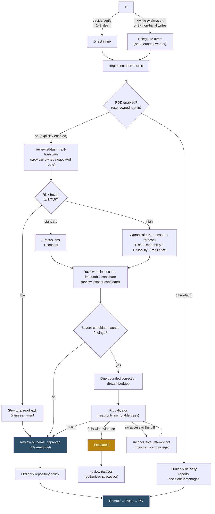
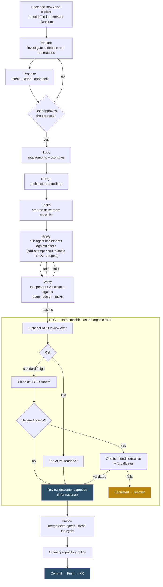

# Gentle-AI — Personal Fork

A focused configurator for Claude Code, Codex, Cursor, Antigravity, and Pi. This fork retains Context7, CodeGraph, Engram, SDD, and the NicoBailon `pi-subagents` integration while removing presentation and community-catalog surfaces that are not part of the personal workflow.

> [!IMPORTANT]
> This repository keeps the upstream Go module path for source compatibility. Do not use an upstream release installer to update this personal build: that would replace it with Gentleman-Programming's binary. Build and install from this fork checkout with `./scripts/install-personal.sh`; the built-in updater intentionally skips self-upgrade and continues updating other managed tools.

## What It Does

Gentle-AI is NOT an AI agent installer. It adapts the agent runtime(s) already on your machine; it never installs one for you. If a selected agent isn't detected, Gentle-AI refuses and names the exact command you'd run yourself instead. It is an **ecosystem configurator** that equips the AI coding agent(s) you already use with persistent memory, Spec-Driven Development (SDD), curated skills, MCP servers, model routing, a teaching-oriented persona, and bounded native review.

**After**: Your agent now has memory, skills, workflow, MCP tools, and a persona that actually teaches you.

### Supported Agent Integrations

| Agent               |         Delegation Model         | Key Feature                                                     |
| ------------------- | :------------------------------: | --------------------------------------------------------------- |
| **Claude Code**     |         Full (Task tool)         | Sub-agents, output styles                                       |
| **Cursor**          |     Full (native subagents)      | 10 SDD agents in `~/.cursor/agents/`                            |
| **Codex**           |            Solo-agent            | CLI-native, TOML config                                         |
| **Antigravity**     |   Solo-agent + Mission Control   | Built-in Browser/Terminal sub-agents                            |
| **Pi**              | Full (package-managed subagents) | First-class `gentle-pi` harness with Pi-native persona/models, SDD, and Engram memory |

> **Pi is package-managed, not just configured.** Selecting Pi installs the first-class [`gentle-pi`](docs/pi.md) harness, which owns Pi-native persona and model controls, SDD assets, chains, and memory wiring.

> **Note**: This project supersedes [Agent Teams Lite](https://github.com/Gentleman-Programming/agent-teams-lite) (now archived). Everything ATL provided is included here with better installation, automatic updates, and persistent memory.

### Organic Routing and Review Boundaries

Every configured agent receives the same outcome-first routing, even when the optional SDD component is not selected. Ask for the outcome; the agent uses exactly one implementation route and reviews the candidate only after implementation.

| Situation | Expected behavior |
| --- | --- |
| Understanding needs 1-3 files, or one mechanical file change is already understood | Keep the bounded action direct and inline. |
| Understanding needs 4+ files, reading prepares a write, broad research is needed, or a writer changes 2+ non-trivial files | Delegate the narrow exploration or one focused writer without creating SDD state. |
| Durable proposal, spec, design, and task artifacts would materially reduce substantial ambiguity | Offer optional SDD; select it only after an explicit request or an accepted proposal. |
| A candidate is ready for review | Freeze the exact bytes and derive review effort from evidence, never size alone. Interactive starts ask once per clone before reviewer work; non-interactive tier-1/tier-2 starts proceed without prompting and report how to disable review mode. |
| Commit, push, PR, or release | Follow ordinary repository policy. Review outcomes are informational and never authorize, block, or govern delivery. |
| Scope changes or an operation is interrupted | Use provider-owned status, recovery, and reconciliation; do not infer authority or replay safety from narration. |

Implementation routing does not decide review strength, and per-action test, build, install, or review workers do not change the selected route. Native commands own repository identity, candidate scope, lifecycle transitions, receipts, and safe continuations. See [Organic Implementation Routing](docs/trigger-rules.md), the [Organic RDD architecture](docs/architecture/organic-rdd.md), and the [review authority threat model](docs/review-authority-threat-model.md).

---

## Quick Start

### Install this fork

```bash
git clone --branch custom/main https://github.com/Alexma03/gentle-ai.git
cd gentle-ai
./scripts/install-personal.sh
gentle-ai sync
```

The installer builds the current checkout with the declared upstream module identity and atomically writes the binary to `${GOBIN:-$HOME/.local/bin}`. To update later, pull `custom/main` and run the script again. This is the supported self-update path on macOS, Linux, and WSL. On native Windows, build `./cmd/gentle-ai` from the fork checkout and replace the current executable after it exits.

`gentle-ai upgrade` never replaces this fork with an upstream release. It reports Gentle AI as manually managed while still upgrading other managed tools.

### Configure project context

After installation, run `gentle-ai install` and select only the runtimes and components you use. Run `gentle-ai doctor` for a read-only health check and `gentle-ai sync` after replacing the binary.

## Core Workflow

1. **Install and configure.** Run the installer, select the agents and components you want, then open your agent in a project.
2. **Use the smallest implementation route.** Keep bounded work direct, delegate actions that need fresh context, and use SDD only after an explicit request or an accepted proposal. SDD artifacts can live in **Engram** for cross-session memory, **OpenSpec** for versioned files, or **hybrid** for both.
3. **Build with discipline.** `/sdd-init` detects project testing capabilities; when Strict TDD is active, SDD apply works test-first. SDD verify audits RED/GREEN evidence and runs verification. Agents that support delegation use focused subagents instead of one growing conversation.
4. **Review one candidate.** After implementation, bounded native review freezes the candidate and reports an informational outcome. Commit, push, PR, and release remain separate decisions under ordinary repository policy; review does not authorize, block, or govern them.

> **Trust what the system can derive, not agent narration.** [Chapter 21 — Verifiable Trust](https://the-amazing-gentleman-programming-book.vercel.app/en/book/Chapter21_Verifiable-Trust) explains the mental model: agents assess the candidate; native review records bounded evidence while ordinary repository policy owns delivery.

1. **Upgrade, then sync.** Refresh the binary and the managed agent assets together:

   ```bash
   gentle-ai upgrade
   gentle-ai sync
   ```

### The flow at a glance

Once you enable it, both implementation routes can converge on RDD: a bounded native review freezes the candidate and reports an informational outcome — review is never reopened for unchanged content. RDD is opt-in, and ordinary repository policy owns delivery whether it is on or off.

**Organic route (no SDD)** — the agent picks the smallest useful route and RDD enters at the end, over the frozen candidate:



**SDD route** — durable planning artifacts first, then apply, independent verify, and an optional RDD review offer; archive and delivery follow ordinary repository policy:



Size, file count, or perceived risk never select SDD on their own — only an explicit request or an accepted proposal does. Either way, one candidate gets one review, one possible correction, and one receipt.

### Control receipt-driven development

Review mode is user-owned and available independently of the review lifecycle. **Receipt-driven development is opt-in: it is off until you turn it on.**

```bash
gentle-ai review mode status --cwd .
gentle-ai review mode enable --scope global --cwd .
gentle-ai review mode disable --cwd .
```

`status` is read-only. With no source expressing an opinion the effective mode is `off`, reported as decided by `default`; only an explicit global enable turns review on. Any global or clone-local disabled source wins; a clone can opt out with `--scope clone` but cannot force review on, so `--scope global` is the only way in. Enabling applies only to future candidates, while declining a one-candidate review prompt does not change the mode. When review is off, native review does not run. Review outcomes are informational in every mode, and ordinary repository policy decides delivery without fabricated approval.

Historical note: `v2.2.2` introduced the native `disabled/unmanaged` disposition. Current SDD status does not use that disposition: with review disabled, it skips review authority, emits no `reviewGate`, and pre-verify continues without routing to a review that cannot start. Archive and delivery proceed under ordinary repository policy; any present review outcome is informational.

### Release verification

Official macOS and Linux release archives require an authenticated `checksums.txt`. The built-in upgrader verifies its Minisign signature, its exact `Gentleman-Programming/gentle-ai` + release-tag binding, and the selected archive checksum **before** replacing the installed binary. Release archives are capped at **128 MiB**, including chunked or unknown-length responses. Missing, oversized, malformed, untrusted, or placeholder key material fails closed without changing the installed binary.

To verify a release manually, obtain the production public-key payload and fingerprint from a maintainer-controlled channel, then download `checksums.txt` and `checksums.txt.minisig` from the same release:

```bash
minisign -VQm checksums.txt -x checksums.txt.minisig -P "$GENTLE_AI_MINISIGN_PUBLIC_KEY"
# Expected output: repo=Gentleman-Programming/gentle-ai;tag=vX.Y.Z
sha256sum --check --strict --ignore-missing checksums.txt
```

Do not bootstrap trust from a public key downloaded only beside the artifacts it verifies. See [Release signing and key rotation](docs/release-signing.md) for the first-signed-release procedure, exact CI injection points, and rotation runbook.

Windows archives and Scoop publication remain omitted until publicly trusted RSA Authenticode signing is provisioned (prefer managed OIDC with Azure Artifact Signing), both amd64 and arm64 executables are signed before archive and checksum generation, and release verification fails if either executable is unsigned.

### Review a focused staged candidate

For a monorepo or shared worktree, explicitly review exactly what is in the Git index:

```bash
git add apps/my-service
git diff --cached
gentle-ai review start --projection staged
```

The staged projection freezes the **complete existing index**, including all previously staged paths. It starts review but does not itself issue an approved receipt; unstaged and untracked worktree content is excluded. The default `workspace` projection remains the complete workspace review, and an existing authority is never auto-converted between projections. See the [review authority threat model](docs/review-authority-threat-model.md) for delivery and base-ref details.

### Backups

Every install, sync, and upgrade automatically snapshots your config files. Backups are **compressed** (tar.gz), **deduplicated** (identical configs are not re-backed up), and **auto-pruned** (keeps the 5 most recent). Pin important backups via the TUI (`p` key) to protect them from pruning.

See [Backup & Rollback Guide](docs/rollback.md) for details.

---

## Key Features You Should Know About

# Via CLI
gentle-ai sync --profile-phase cheap:sdd-design:anthropic/claude-sonnet-4-20250514
